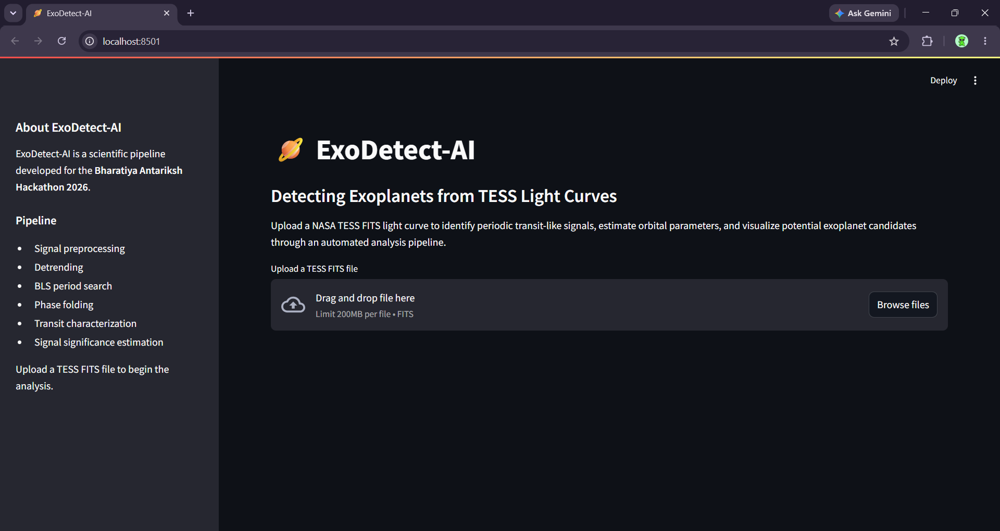
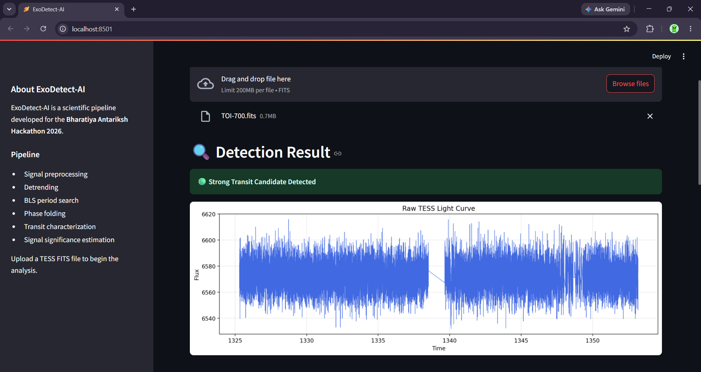
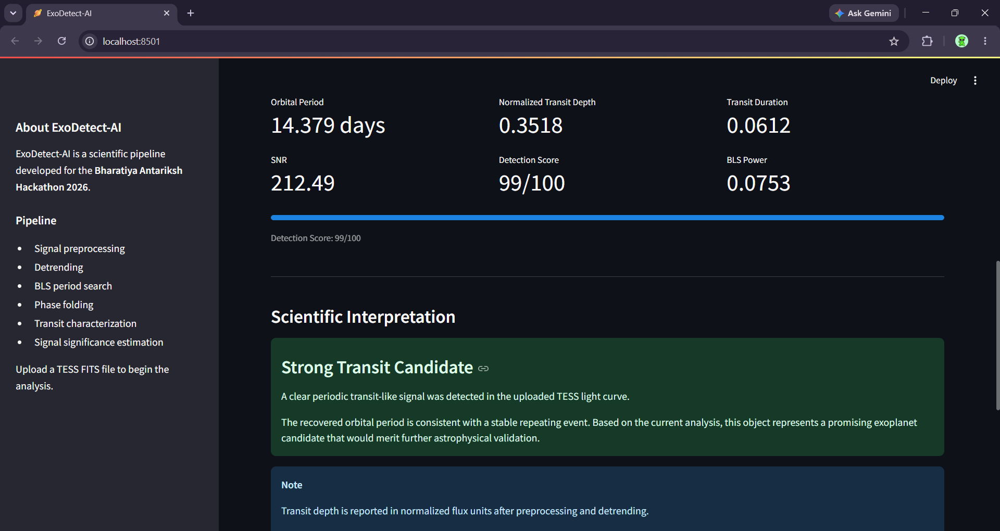

# ExoDetect-AI

<p align="center">


</p>

<p align="center">

**AI-assisted Detection of Exoplanets from Noisy TESS Light Curves**

Developed for **Bharatiya Antariksh Hackathon 2026**

</p>

---

# Overview

ExoDetect-AI is an end-to-end scientific software pipeline developed for the **Bharatiya Antariksh Hackathon 2026** to automate the detection of potential exoplanet transit signals from noisy astronomical observations.

Instead of relying solely on a binary machine learning classifier, the project follows the standard workflow commonly used in observational astronomy. Starting from raw **NASA TESS** light curves, the pipeline performs signal preprocessing, detrending, periodic signal detection, phase folding, transit characterization and signal significance estimation before presenting the results through an interactive web application.

The objective of this project is not only to identify transit-like events but also to provide interpretable physical parameters that help users understand the detected signal.

---

# Motivation

The discovery of exoplanets is one of the most active areas of modern astronomy.

The Transit Method detects planets by observing tiny periodic decreases in the brightness of a star as a planet passes in front of it. These changes are often less than one percent of the star's total brightness and are easily obscured by detector noise, stellar variability and instrumental artifacts.

Astronomers frequently work with thousands of light curves, making manual inspection slow and inefficient.

ExoDetect-AI aims to automate this workflow by combining established astronomical techniques with a modular software architecture capable of analysing real TESS observations.

---

# Project Highlights

* End-to-end exoplanet transit detection pipeline
* Works directly with NASA TESS FITS files
* Automated preprocessing and detrending
* Period detection using Box Least Squares (BLS)
* Transit characterization
* Signal significance estimation
* Interactive Streamlit dashboard
* FastAPI backend for programmatic access
* Modular architecture designed for future CNN and Transformer integration

---

# Application Preview


## Home Screen



---

## Light Curve Visualization



---

## Detection Results



---

# Pipeline Overview

```
Raw TESS FITS Light Curve
            │
            ▼
     FITS File Loading
            │
            ▼
     Signal Preprocessing
            │
            ▼
         Detrending
            │
            ▼
 Box Least Squares Search
            │
            ▼
       Phase Folding
            │
            ▼
  Transit Characterization
            │
            ▼
 Signal Significance
            │
            ▼
 Interactive Visualization
```

---

# Key Features

The current implementation provides the following functionality:

* Reading raw TESS FITS observations
* Missing-value removal
* Sigma-clipping based noise filtering
* Flux normalization
* Signal smoothing
* Light curve detrending
* Orbital period estimation using Box Least Squares
* Phase folding
* Transit depth estimation
* Transit duration estimation
* Transit center estimation
* Signal-to-noise estimation
* Detection scoring
* Interactive Streamlit dashboard
* REST API using FastAPI
* Downloadable JSON detection report

---

# Project Structure

```
ExoDetect-AI/

app/
│── api.py
│── streamlit_app.py

pipeline/
│── detector.py

features/
│── signal_processing.py
│── detrending.py
│── bls_search.py
│── phase_folding.py
│── transit_analysis.py
│── significance.py

models/

training/

evaluation/

utils/
│── fits_loader.py

data/

README.md
requirements.txt
```

---

# Installation

Clone the repository:

```bash
git clone https://github.com/<your-username>/ExoDetect-AI.git
cd ExoDetect-AI
```

Install all required dependencies:

```bash
pip install -r requirements.txt
```

---

# Running the Application

## Streamlit Dashboard

Launch the interactive dashboard:

```bash
streamlit run app/streamlit_app.py
```

The dashboard allows users to:

* Upload a TESS FITS file
* Visualize the raw light curve
* Perform automated transit detection
* View recovered orbital parameters
* Download a JSON report

---

## FastAPI Backend

Launch the REST API:

```bash
uvicorn app.api:app --reload
```

Interactive API documentation will be available at:

```
http://127.0.0.1:8000/docs
```

The API can be used to integrate the detection pipeline into other scientific workflows or external applications.

---
# Dataset

The project uses publicly available observations from **NASA's Transiting Exoplanet Survey Satellite (TESS)**.

TESS continuously monitors the brightness of hundreds of thousands of stars to identify periodic dimming events that may indicate the presence of orbiting exoplanets.

During development and testing, the following confirmed planetary systems were used:

* TOI-700
* WASP-18
* Pi Mensae
* HD 219134
* LHS 3844

The pipeline accepts standard **FITS** light curve files and processes them automatically through the complete detection workflow.

---

# Example Output

For every uploaded light curve, ExoDetect-AI estimates:

* Orbital Period
* Normalized Transit Depth
* Transit Duration
* Transit Center
* Signal-to-Noise Ratio (SNR)
* Detection Score
* BLS Detection Power

The application also provides:

* Interactive visualization of the raw light curve
* Scientific interpretation of the detected signal
* Downloadable JSON report

Example output:

```json
{
    "period": 14.37887887887888,
    "bls_power": 0.07533509192097214,
    "noise": 0.001655837520956993,
    "transit_depth": 0.35184194425116755,
    "transit_duration": 0.0612030029296875,
    "transit_center": 0.10858917236328125,
    "snr": 212.48577880859375,
    "confidence": 1.0
}
```

---

# Validation

To evaluate the scientific correctness of the pipeline, publicly available TESS observations of confirmed exoplanet systems were analysed.

One validation example is **TOI-700**, where the recovered orbital period is approximately:

```
Recovered Period
≈ 14.38 days
```

which closely matches the published orbital period of the system.

This agreement demonstrates that the implemented Box Least Squares search and transit analysis pipeline successfully identifies the expected periodic transit signal.

---

# Technologies Used

The project combines astronomical data analysis libraries with modern software engineering tools.

### Programming Language

* Python

### Scientific Computing

* NumPy
* SciPy
* Pandas
* Astropy
* Lightkurve
* Matplotlib

### Machine Learning

* TensorFlow
* Scikit-learn
* XGBoost

### Web Technologies

* Streamlit
* FastAPI
* Uvicorn

---

# Current Status

The current implementation provides a complete scientific workflow capable of:

* Loading raw TESS FITS observations
* Performing automated preprocessing
* Removing long-term trends
* Detecting periodic transit-like events
* Estimating transit parameters
* Computing signal significance
* Displaying results through an interactive dashboard
* Exporting structured detection reports

The repository also includes the initial architecture for CNN-, Transformer- and XGBoost-based models that can be trained using larger labelled astronomical datasets in future work.

---

# Known Limitations

Although the project demonstrates a complete automated detection workflow, several limitations remain:

* The Detection Score is a heuristic ranking metric and should not be interpreted as the probability that an object is a confirmed exoplanet.
* Transit depth is reported in normalized flux units after preprocessing.
* The current implementation analyses one target light curve at a time.
* Deep learning models included in the repository have not yet been trained on a large labelled TESS dataset.
* Scientific confirmation of an exoplanet requires additional astrophysical validation and independent observations.

---

# Future Work

Potential future improvements include:

* Training CNN and Transformer models on curated labelled TESS datasets
* Improved false-positive rejection
* Bayesian uncertainty estimation
* Multi-planet detection
* Batch processing of multiple light curves
* GPU acceleration
* Cloud deployment using Hugging Face Spaces
* Real-time analysis through web APIs

---

# Frequently Asked Questions

## Why was the Box Least Squares (BLS) algorithm used?

BLS is one of the standard algorithms used in exoplanet research to detect periodic box-shaped transit signals. Since planetary transits resemble box-like dips in stellar brightness, BLS provides an efficient and reliable method for identifying candidate orbital periods.

---

## Why is phase folding important?

Phase folding aligns all detected transit events into a single orbital cycle. This increases the visibility of weak periodic signals and enables more reliable estimation of transit properties.

---

## What does the Detection Score represent?

The Detection Score is an internal heuristic derived from the recovered transit signal after preprocessing and period detection. It is intended to indicate the quality of the detected signal and should not be interpreted as the statistical probability that the object is a confirmed exoplanet.

---

## Why is the transit depth reported as "Normalized Transit Depth"?

The light curves are normalized during preprocessing to improve the robustness of the detection pipeline. As a result, the reported transit depth is expressed in normalized flux units rather than as a direct percentage decrease in stellar brightness.

---

## Does this project use Artificial Intelligence?

The current implementation focuses on an end-to-end astronomical detection pipeline consisting of preprocessing, detrending, Box Least Squares period search, phase folding and transit characterization.

The repository also contains modular CNN, Transformer and XGBoost components that are intended for future integration after training on sufficiently large labelled datasets.

---

## How was the pipeline validated?

The detector was evaluated using publicly available observations of confirmed exoplanet systems.

For example, the recovered orbital period for **TOI-700** closely matches the published value of approximately **14.38 days**, demonstrating that the implemented detection pipeline successfully identifies the expected periodic transit signal.

---

## Can this software confirm the existence of an exoplanet?

No.

The software identifies promising transit candidates and estimates their physical parameters.

Scientific confirmation requires additional astrophysical analysis, follow-up observations and independent validation.

---

## Can this project analyse other astronomical datasets?

Yes.

The modular architecture allows the pipeline to be adapted to other transit-photometry datasets with appropriate preprocessing.

---

# Acknowledgements

This project was developed for the **Bharatiya Antariksh Hackathon 2026**.

We gratefully acknowledge:

* NASA's Transiting Exoplanet Survey Satellite (TESS) mission
* Mikulski Archive for Space Telescopes (MAST)
* The Lightkurve development community
* The Astropy Project

Their open scientific software and publicly available datasets made this project possible.

---

# Final Remarks

ExoDetect-AI demonstrates how established astronomical signal-processing techniques can be integrated into a modular software pipeline for automated exoplanet transit analysis.

Rather than treating exoplanet detection as a simple binary classification problem, the project follows a transparent scientific workflow that provides interpretable intermediate results alongside the final detection output.

The modular design allows future integration of deep learning models, larger labelled datasets and more advanced astrophysical validation methods, making ExoDetect-AI a strong foundation for future research and educational applications.

---

## License

This project is intended for educational and research purposes.

---

<div align="center">

If you found this project useful or interesting, feel free to give the repository a star.

Developed for the Bharatiya Antariksh Hackathon 2026

</div>